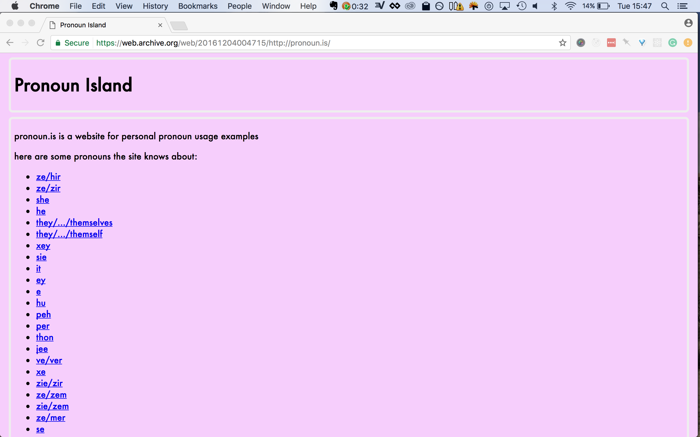
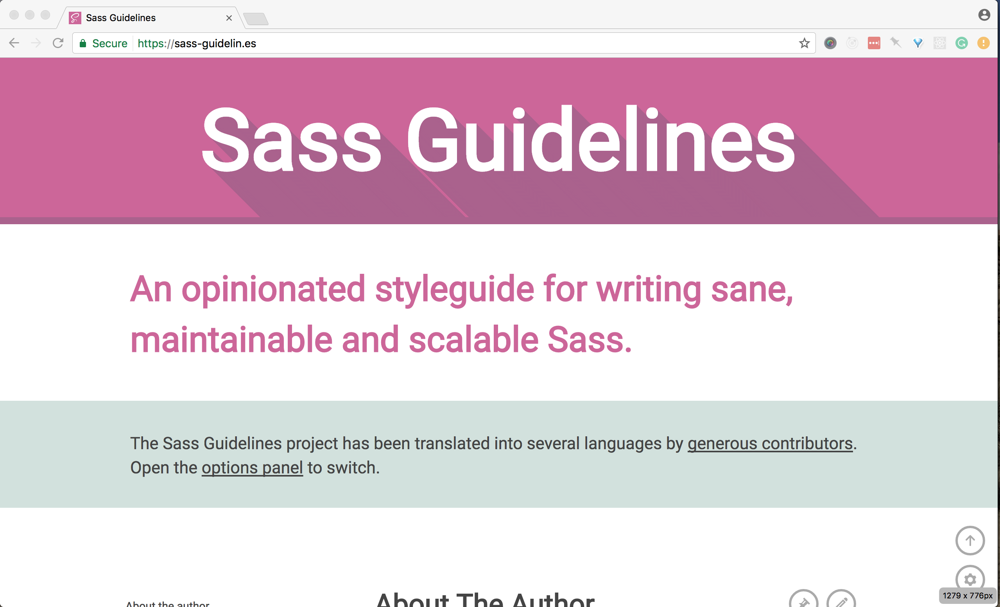
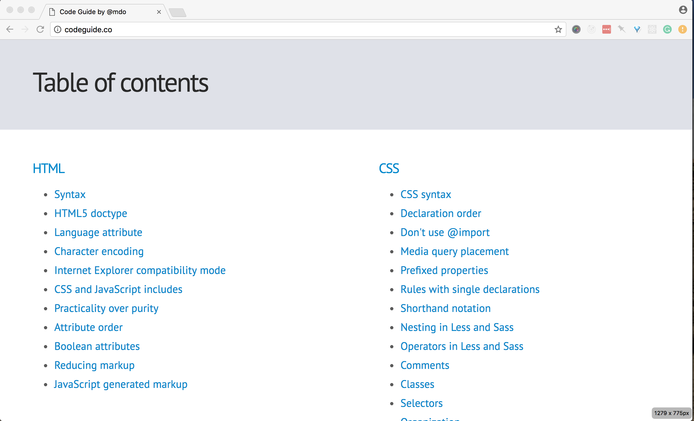
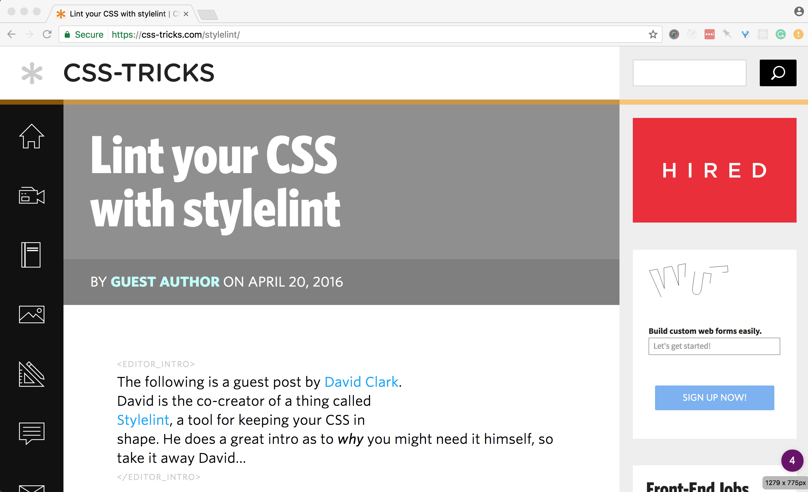

# Hiring Patterns for Candidates

Claudina Sarahe, [@itsmisscs](https://twitter.com/itsmisscs)

----

## My Preferred Gender Pronoun (PGP)

she/her/they/them



----

## <span class="highlight">What I Do:</span> Independent Consultant

Product, Strategy, Team Building, Development, Training

Note: help scale products and teams. i work a lot
between design and development but also management and leadership. holistic.

----

# 12 years professionally

Note: Untraditional path, too

----

# Things I've done

* Consulting Director Frontend Engineering, Casper<!-- .element: class="fragment" data-fragment-index="1" -->
* Co-creator SassConf, Conference for Front-end<!-- .element: class="fragment" data-fragment-index="2" -->
* Co-founder and alumna organizer GothamSass<!-- .element: class="fragment" data-fragment-index="3" -->
* Co-founder Autotax. Y Combinator Finalist<!-- .element: class="fragment" data-fragment-index="4" -->

Note:

----

# Passion Projects

* Learning Portuguese
* Woodworking

---

# Outline: This workshop

* Why I'm passionate about hiring, teams, organizations
* Ways to Prepare
* Invest in Learning

Note: Experiences from hiring at high growth startups and learnings from organizing, work in worker-owner models, agency...

---

## Sustaining inclusive and diverse teams begin with inclusive processes

Note: You are what you eat adage holds true. I believe that an
in order to have an enjoyable hiring process that yields diverse, inclusive, creative, productive teams you must
have an inclusive process. process indicative of the team.

----

## Hiring process reflects character of team

Note:

---

## Shows the color of the company culture

----

## Hiring is dialogue between potential candidates and team

Leveling of the power structure

Note:
You learn about them while they also learn about you. Key to know your position (tenets, talk about later). Or maybe more like

---

## Companies aren't always getting it right


Note: all too often the hiring process is horrible
soul wrenching experience. it is this way for everyone.

---

# First Steps

* Define your tenets<!-- .element: class="fragment" data-fragment-index="1" -->
* Do your research<!-- .element: class="fragment" data-fragment-index="2" -->

Note: Tenets drive research

----

# Defining your tenets

* What do you hold valuable in a role?<!-- .element: class="fragment" data-fragment-index="1" -->
* What do you want out of the position?<!-- .element: class="fragment" data-fragment-index="2" -->
* What's most important to you—mentorship?<!-- .element: class="fragment" data-fragment-index="3" -->

Note: What values do you want out of a place to work. If you can, prioritize them. What do you want to get out of the job? clear: room to grow, better process; for a new dev could be get a job on respectful teams. Pause to let
students define tenets. Work life balance. Perks? Remote or ability to work from home. Flexibility.

---

# Put time into research

Note: Helps you come prepared. Depends on your first touch, how you are getting to meet. Questions for hiring managers, phone screens. Ask for thinigs you don't get.

----

# Detective Work

Don't be shy, reach out to people.

Note: Reach out to employees on Twitter or at Meetups to help you learn more. Linkedin.

----

## Researching the team

- Social media presence<!-- .element: class="fragment" data-fragment-index="1" -->
- Team page / About us page<!-- .element: class="fragment" data-fragment-index="2" -->
  - Imagery<!-- .element: class="fragment" data-fragment-index="3" -->
  - Language and tone of the content<!-- .element: class="fragment" data-fragment-index="4" -->
- Participation in the community (OSS, Meetups, Conferences)<!-- .element: class="fragment" data-fragment-index="5" -->

Note: Use your tenets to help you organize your research. For example, if you
value learning, did you find any information about learning? If not, add that to list of questions to ask the company (if interviewing) or people that work there

----

## Ask about day to day

* What's the process for a typical feature or sprint?<!-- .element: class="fragment" data-fragment-index="1" -->
* How do you spend your day?<!-- .element: class="fragment" data-fragment-index="2" -->
* What does a typical day for team member look like?<!-- .element: class="fragment" data-fragment-index="3" -->

Note: Ask about someone at your level and also ask above is you are looking to grow

----

## Ask about mentorship and career growth

* Pairing <!-- .element: class="fragment" data-fragment-index="1" -->
* Code review process <!-- .element: class="fragment" data-fragment-index="2" -->
* How are code decisions and standards formed? <!-- .element: class="fragment" data-fragment-index="3" -->
* Learning budget—encouraged to learn<!-- .element: class="fragment" data-fragment-index="4" -->
* Developer ratio (Junior to Senior)<!-- .element: class="fragment" data-fragment-index="5" -->
* Tech stack<!-- .element: class="fragment" data-fragment-index="6" -->

Note: Care about your growth. Answers revel the team and type of environment. clues that help you rank
against your tenets.

---

# Be open to new languages

Note: While knowing and going after what you want is important. Sometimes the way in is with something else that opens a portal. Is one of your tenets to
learn?

---

## Reflections on starting out

* Creating French graphics in Photoshop<!-- .element: class="fragment" data-fragment-index="1" -->
* Manual data entry and small bug fixes<!-- .element: class="fragment" data-fragment-index="2" -->

----

## One day, my own small independent project

Note: Nice segue way to...

---

# Preparing for code challenge

Note: Code challenges. Different everywhere. Vary a lot by team. I
believe that they are important clues to org and team structure

----

# Timed challenges

Practice, practice, practice.

Note: JavaScript 30 Challenge, Daily exercises

----

# Take home challenge

Note: Go go over more in detail

----

# ~~Whiteboarding~~

Note: You are not alone in thinking these are horrible

----

## Repos of companies that do not whiteboard


----

### If if you do end in front of one...

- Test your logic and reasoning
- Talk through your thoughts

Note: Personal opinions. Practice narrating answers. Peer code review.

---

# Tips for Take Home Code Challenges

(helpful for other challenges, too)

Note: I'm a proponent of take home code challenges. while they can take longer they offer a better view of the candidate

----

## Biggest challenge:

- More realistic of feature work<!-- .element: class="fragment" data-fragment-index="1" -->
- Higher expectation based on time<!-- .element: class="fragment" data-fragment-index="1" -->
- Make a schedule<!-- .element: class="fragment" data-fragment-index="1" -->
- Clarify any directions after you receive it<!-- .element: class="fragment" data-fragment-index="1" -->
- Communicate if you need more time<!-- .element: class="fragment" data-fragment-index="1" -->
- Be ready to communicate your choices and direction<!-- .element: class="fragment" data-fragment-index="1" -->

----

## Provide a `recap.md`

Your opportunity to give a bit more context into your code challenge

* What went well? <!-- .element: class="fragment" data-fragment-index="1" -->
* What would you improve given/more time resources?<!-- .element: class="fragment" data-fragment-index="2" -->
* Do you have any feedback on the challenge (what would you change, improve, keep…)?<!-- .element: class="fragment" data-fragment-index="3" -->

Note: Anecdote about how got this from a candidate. These are great way to
provide more perspective about your work. Mini standup/down

---

## Documentation: Does your project include a `README.md`?

Note: how detailed does it get. if you do something different, note it. documentation helps people.

---

# Directory Organization

Note: Lots of patterns here. Here's good vs signs of lack of organization

----

## Common patterns

Within the root folder:

* Core code files: `src/` or `app/`
* Compiled files: `dist`, `public/`, `build/`

----

### Example: Good Directory Structure

```
app
├── js
│   │── vendor/
│   │   ├── jquery.js
│   └── main.js
├── css
│   └── main.css
├── views
│   └── index.html
├──
dist
├── // compiled assets

```

---

## Consistency & Readability

- Spacing, indentation <!-- .element: class="fragment" data-fragment-index="1" -->
- Naming <!-- .element: class="fragment" data-fragment-index="2" -->
  - File names <!-- .element: class="fragment" data-fragment-index="3" -->
  - Classes, functions<!-- .element: class="fragment" data-fragment-index="4" -->
- Documentation <!-- .element: class="fragment" data-fragment-index="5" -->
* Stale code (e.g. commented out) <!-- .element: class="fragment" data-fragment-index="6" -->

Note:

----

## Code documentation

JSDOC style syntax across all file types


----

## Linters & Code/Style Guidelines

* Plugins available for most editors

----

## ESLint


Note: Pluggable different standards

----

## AirBnb Code Standards


----

## Lots of standards

* [JS Standard](https://github.com/feross/standard)
* [Google](https://github.com/google/eslint-config-google)

----

### Harry Roberts, CSS Guidelines


----

## Hugu G, Sass Guidelines



----

## MDO, Code Guide



----

## Stylelint



----

## csscomb


----

## Other CSS/Sass Linters

* [Sass-lint](https://github.com/sasstools/sass-lint)
* [SCSS Lint](https://github.com/brigade/scss-lint)

---

## Naming is hard

Be a great artist, steal and remix from other frameworks

Note: Check out semantic UI or frameworks for ideas. visit sites you like.

---

## Master Patterns

* JavaScript Design Patterns
* Functional Programming

---

## Command & Understanding of HTML

* Are you using the most semantically appropriate element? <!-- .element: class="fragment" data-fragment-index="1" -->
* Is accessibility a fore or afterthought? <!-- .element: class="fragment" data-fragment-index="2" -->

Note: Very challenging. Area of most difficulty.

----

## #1: Know your tags

```
<div class="price">
  ${{ price }}
</div>
```

----

## Answer: Daily Double

```
<label name="price-field">Cost</label>
<output for="price-field" name="price" class="price">
  ${{ price }}
</output>
```

Represents the result of a calculation or user action.

Note: Okay. Esoteric. But this isn't..

----

```
<div class="btn">
  Get it
</div>
```

## `<div>` is not `<button>`

----

## #2: Know Your Tags

_(HTML is more than divs)_

```html
<div class='item'>
  <div class='item__name'>{{ name }}</div>
  <div class='item_description'>{{ description }}</div>
  <div class='item_price'>{{ price }}</div>
  <div class='item__purchase' data-name='{{ name }}' data-price='{{ price }}'>
    <div class='btn'>
      Get it
    </div>
  </div>
</div>
```

----

```html
<article class='item'>
  <h2 class='item__name'>{{ name }}</h2>
  <p class='item_description'>{{ description }}</p>
  <output for="price-field" name="price" class="price">${{ price }}</output>
  <div class='item__purchase' data-name='{{ name }}' data-price='{{ price }}'>
    <button class='btn'>
        Get it
    </button>
  </div>
</article>
```

---

# Accessibility

* Understanding of A and AA
* Aria roles and patterns

Note: Look at libraries for clues. Some people worth following in the field

----

## [Heydon works Practical Accessibility](http://heydonworks.com/practical_aria_examples/)


----

## [Marcy Sutton](http://heydonworks.com/practical_aria_examples/)


---

# CSS

* Understanding of specificity<!-- .element: class="fragment" data-fragment-index="1" -->
* CSS Architecture<!-- .element: class="fragment" data-fragment-index="2" -->
* Organization<!-- .element: class="fragment" data-fragment-index="3" -->
* Style<!-- .element: class="fragment" data-fragment-index="4" -->

----

```
button.delete {

}
```

## Over-qualifying elements
<!-- .element: class="fragment" data-fragment-index="1" -->

----

## Do you style IDs?

[NAY]()<!-- .element: class="fragment" data-fragment-index="1" -->

----

## Empty Rule Sets

Don't leave empty rulesets

```
.price {
}
```

----

## Know your CSS units

Show consistency or understanding of usage patterns

```
.sidebar {
  margin-left: 3%;
  padding: 1.5em 40px;
}
```

Note: Understand what power each unit gives you and why to use it

----


Note: you still keep px size adjustments at the document level so you can make
easy/efficient sweeping size changes. But then each module on the page has
a font-size set in rem. Actual text elements (h1, h2, p, li, whatever),
if you size them at all, are sized in em, and thus become relative to the module.

----

## Use Autoprefixer for vendor prefixing

No need to handwrite vendor prefixes.

```css
@mixin box-sizing( $type: border-box ) {
    -webkit-box-sizing: $type;
       -moz-box-sizing: $type;
         -o-box-sizing: $type;
        -ms-box-sizing: $type;
            box-sizing: $type;
}

*,
*::before,
*::after {
  @include box-sizing(border-box);
}
```

Note: If you are using a build process. Autoprefixer is available for most build processes

----

```css
@mixin box-sizing( $type: border-box ) {
  box-sizing: $type;
}

*,
*::before,
*::after {
  @include box-sizing(border-box);
}
```

----

## CSS Architecture

Structure and design of your code

Note: some are more about styles and less prescriptive about organization. others are more coupled.

----

## CSS Patterns

* OOCSS <!-- .element: class="fragment" data-fragment-index="1" -->
* SMACSS <!-- .element: class="fragment" data-fragment-index="2" -->
* BEM <!-- .element: class="fragment" data-fragment-index="3" -->
* CSS Modules <!-- .element: class="fragment" data-fragment-index="4" -->
* ITCSS <!-- .element: class="fragment" data-fragment-index="5" -->
* ExpressiveCSS <!-- .element: class="fragment" data-fragment-index="6" -->
* FunctionalCSS <!-- .element: class="fragment" data-fragment-index="7" -->

---

# React CSS Patterns

* CSS Modules
* Styled Components

----

# Gulp.js for making builds

* Easy to grok <!-- .element: class="fragment" data-fragment-index="1" -->
* Lots of tutorials <!-- .element: class="fragment" data-fragment-index="2" -->
* More intuitive working with HTML templates <!-- .element: class="fragment" data-fragment-index="3" -->
* Gulp 4.0.0 is stagnant :(<!-- .element: class="fragment" data-fragment-index="4" -->

----

### But isn't Webpack the thing?!?!

Note: Yes, important to know it. But also what tool is best for the job. Example, building a static static (.html pages)

----

## Avoid coupling HTML + JS

```
$(".cart .count").html(count);
$(".cart .total").html(total);
```

Note: Going to refactor.... better

----

## Use JS Selectors

```
$(".js-cart .js-count").html(count);
$(".js-cart__count").html(count);
```

---

# Misc Tidbits

---

## Your writing says a lot about you

- Proofread, eg. Grammarly
- Get opinions

----

## Always test your code before submitting

Avoid the dreaded `-g`

* Wipe your node modules<!-- .element: class="fragment" data-fragment-index="1" -->
* Re-install node version<!-- .element: class="fragment" data-fragment-index="2" -->
* Ask a friend to try out<!-- .element: class="fragment" data-fragment-index="3" -->

----

## Manage node versions with `nvmrc`

Or, `n`. Both are good options.

---

## Give credit were it is due
### We all copy pasta

Note: Include license files or mentions in code comments. Add mention in your
readme. This also shows that you keep up.

----

# First touch says a lot

Note: How did they reach to you? How did they treat you? Did they respect your time?

----

## Follow up if they say "Right fit later".

Note: So many people I wanted to hire but needed to wait until there was stability. Be sincere about this by working with TS to keep in touch. As candidate, if you really liked it, follow up, even if you do get a job. If no movement after 6 months, tell candidate.

----

## Get feedback by asking for it

Note: Candidates, ask for feedback. What's one things I could improve on my test? If tenets, feedback becomes really easy to give.

----

## Find your niche

* Refactoring
* Performance
* Responsive Images
* Animations

Note: Each area has sub-components

----

## Show your drive & passion

Note:

---

> I'm still learning - Michael Angelo

Note: An invest in learning shows that you are serious about advancing

----

# Invest in learning

----

# Master core languages of our craft

JS, CSS, HTML

Note: We valued JS, CSS, HTML. I stand that a good developer can and will know everything. I will forever always test core languages over frameworks. I really think it depends where you are applying

----

# How do you keep up with the industry?

Note: If a scientist doesn't keep up with research in their field,
they will become obsolete. This was one of my pass/fail questions. Why? If you
are not invested in learning, you will not be an active team member.

----

## Find your method

* Digest Lists & Newsletter
* Podcasts
* Meetups
* Conferences (volunteer at them)
* Twitter accounts and lists
* Slack groups
* Medium
* Books

----

* Panda
* Awesome list repos
* Callback Women
* League of Lady Coders
* GothamSass

----

# Meetups & Events

From Meetup.com and beyond. Psst, lurk on Twitter.

----

## BoroughJS Family of Meetups

* BrooklynJS
* QueensJS
* ManhttanJS
* JerseyScript
* Nodebots

----

### [ManhttanJS]()


[Twitter]()

----

### [BrooklynJS]()


[Twitter]()

----

### [JerseyScript]()


[Twitter]()

----

### Nodebots]()


[Twitter]()

---

# Reading

----

## [Sidebar.io](sidebar.io) Design Newsletter


----

## Hack the industry pulse with conference videos

* Bleeding edge. Hottest. (0-18 months)
* Best practices (3+ years)
* What’s on the mind of the community?

Note:

----

## Setup a simple build process

* Process CSS <!-- .element: class="fragment" data-fragment-index="1" -->
* Transpile JavaScripts <!-- .element: class="fragment" data-fragment-index="2" -->
* Compile HTML Templates <!-- .element: class="fragment" data-fragment-index="3" -->
* Minify and prepare for production <!-- .element: class="fragment" data-fragment-index="4" -->

---

## Make your own portfolio site

----

## Local small-business or organization in your neighborhood

Note: my first site was for a professor

----

## Javascript 30 Challenge


----

## http://bit.ly/awesomecasts

----

## Toolsday.io

----

## Teach and/or Volunteer for local code programs

----

### BlackGirlsCode NYC


----

### Coder Dojo NYC


----

## Contribute to OSS project

- Many have https://github.com/MunGell/awesome-for-beginners

----

## Show activity

* Are you going to meetups?<!-- .element: class="fragment" data-fragment-index="1" -->
* Do you have code examples?<!-- .element: class="fragment" data-fragment-index="2" -->

----

## Pulse

(Remember, a solid foundation is required to build a tower)

* Async/wait<!-- .element: class="fragment" data-fragment-index="1" -->
* CSS Grids<!-- .element: class="fragment" data-fragment-index="2" -->
* Immutable Data Structures<!-- .element: class="fragment" data-fragment-index="3" -->
* Functional all the things<!-- .element: class="fragment" data-fragment-index="4" -->
* Flexbox<!-- .element: class="fragment" data-fragment-index="5" -->
* Progressive Web Apps<!-- .element: class="fragment" data-fragment-index="6" -->
* Design Systems<!-- .element: class="fragment" data-fragment-index="7" -->
* Performance<!-- .element: class="fragment" data-fragment-index="8" -->

---

# Feedback & Questions
